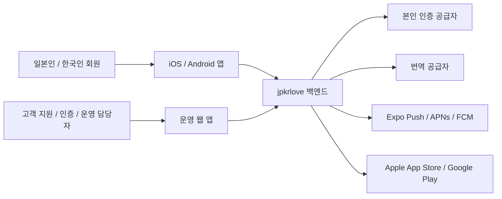
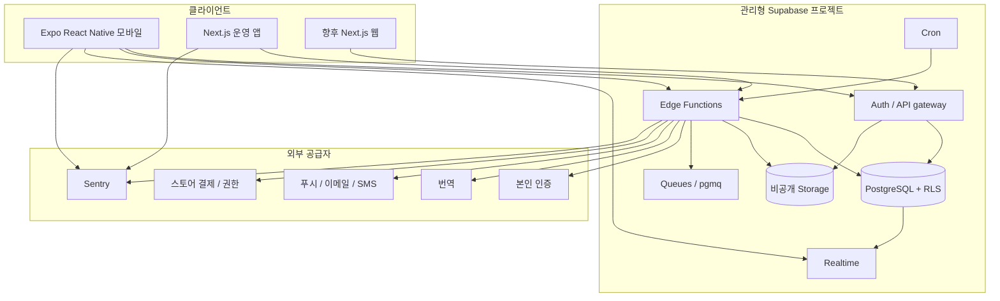

# jpkrlove 아키텍처

## 1. 아키텍처 목표

아키텍처는 신뢰할 수 있는 iOS/Android MVP를 빠르게 제공하면서도 MVP의 임시방편이 핵심 개인정보, 권한, 도메인 경계에 남지 않게 해야 한다. 관심사의 우선순위는 다음과 같다.

1. 사용자 안전, 개인정보 보호, 올바른 권한 부여.
2. 빠른 제품 학습과 출시 주기.
3. 명확한 소유권과 테스트 가능한 도메인 규칙.
4. 소규모 팀으로 운영 가능한 구조.
5. 재작성 없이 웹과 더 큰 규모로 확장할 수 있는 기반.

선택한 방식은 **TypeScript 모노레포와 관리형 모듈형 모놀리스**이다. 의도적으로 마이크로서비스를 선택하지 않는다.

## 2. 시스템 컨텍스트



## 3. 컨테이너 아키텍처



## 4. 기술 결정

| 영역 | 선택 | 이유 |
| --- | --- | --- |
| 모바일 | Expo + React Native + TypeScript | 하나의 제품 팀과 코드베이스로 iOS/Android를 개발하고, 네이티브 확장 가능성과 빠른 빌드/업데이트 흐름 확보 |
| 내비게이션 | Expo Router | 파일 기반 라우팅, 딥 링크, 타입 라우트 지원, 유니버설 라우트로 확장 가능한 경로 |
| 브라우저 앱 | Next.js + TypeScript | 마케팅, 회원용 웹, 운영 화면에 적합한 렌더링 및 데스크톱 UI 모델 |
| 백엔드 플랫폼 | Supabase | 관리형 Auth, PostgreSQL, RLS, Storage, Realtime, 함수, 로컬 마이그레이션 |
| 데이터 저장소 | PostgreSQL | 관계 무결성과 트랜잭션형 매칭/안전 규칙이 도메인에 적합 |
| 백엔드 연산 | Supabase Edge Functions | 권한 및 연동 워크플로를 TypeScript로 빠르게 제공 |
| 비동기 처리 | Supabase Queues와 Cron | MVP에서 독립 브로커를 추가하지 않고 내구성 있는 작업 처리 |
| workspace | pnpm + Turborepo | 앱과 패키지 전체에서 결정적 의존성 관리와 범위 지정 작업 실행 |
| CI/CD | GitHub Actions + EAS + Supabase CLI | 검토 가능한 자동 검증과 환경 승격 |
| 관측성 | Sentry와 플랫폼 로그/메트릭 | 공용 요청 상관관계와 모바일/백엔드 오류 가시성 |

기술 버전은 초기 구성 시점의 안정적이고 지원되는 릴리스에서 선택하고 잠금 파일에 고정한 뒤 의도적으로 업그레이드한다. 메이저 업그레이드에는 preview 빌드, 마이그레이션 설명, 핵심 경로 테스트가 필요하다.

## 5. 도메인 모듈

모놀리스는 기술 계층이 아니라 비즈니스 역량으로 분리한다.

| 모듈 | 소유 범위 |
| --- | --- |
| 신원 및 접근 | 계정, 세션 연결, 법적 동의, 계정 상태 |
| 프로필 | 공개 프로필, 선호 조건, 언어와 결혼 의향 |
| 신뢰 | 본인 인증 케이스와 인증 결과 |
| 탐색 | 자격, 필터, 랭킹 입력, 추천 이력 |
| 매칭 | 좋아요, 상호 매칭, 매칭 해제 수명 주기 |
| 메시지 | 대화, 메시지, 번역 상태 |
| 안전 | 차단, 신고, 운영 검토 케이스와 조치 |
| 알림 | 기기 설치, 설정, 전달 |
| 권한 | 요금제 기능과 구매 정합성 검사 |
| 운영 | 운영자 권한, 케이스 큐, 감사 |

모듈은 안정적인 ID와 발행된 도메인 이벤트를 공유할 수 있다. UI 코드에서 다른 모듈의 테이블을 직접 변경해서는 안 된다. 모듈 간 불변조건은 검토된 데이터베이스 함수 또는 트랜잭션을 사용하는 Edge Function 오케스트레이션으로 구현한다.

## 6. 의존성 규칙

```text
UI route -> feature application logic -> repository port -> Supabase adapter
                                      -> provider port  -> provider adapter

domain package -> 프레임워크 또는 공급자 의존성 없음
```

- 공급자 SDK 타입은 어댑터 경계를 넘지 않는다.
- Edge Functions는 도메인 스키마와 사용 사례를 공유하지만 배포 진입점은 얇게 유지한다.
- 데이터베이스 테이블은 공개 API가 아니다. 클라이언트는 애플리케이션 읽기 모델과 안정적인 저장소 결과를 사용한다.
- service-role 작업은 신뢰할 수 있는 서버 컨텍스트에만 존재한다.
- 공급자 웹훅은 인증과 멱등성을 확인하고, 도메인 상태를 바꾸기 전에 내부 이벤트로 변환한다.

## 7. 주요 요청 흐름

### 7.1 권한이 있는 프로필 읽기

모바일 앱은 저장소 어댑터를 통해 회원 JWT를 전송한다. PostgreSQL RLS가 프로필 읽기 모델에 자격 및 차단 정책을 적용한다. 비공개 매칭 필드와 운영 필드는 이 모델에 포함하지 않는다.

### 7.2 상호 매칭

앱은 멱등성 키와 함께 권한이 필요한 매칭 엔드포인트를 호출한다. 엔드포인트는 자격과 차단을 검증하고 좋아요를 기록하며 최대 하나의 매칭/대화를 생성하고 큐 이벤트를 커밋하는 단일 트랜잭션을 실행한다. 알림은 커밋 후 비동기로 전달한다.

### 7.3 번역이 있는 메시지

원문 메시지를 먼저 커밋한다. Realtime은 승인된 대화 참여자에게만 원문을 노출한다. 내구성 있는 작업이 번역을 요청하고 파생 번역 레코드를 저장한다. 번역 실패는 원문 메시지나 전달에 영향을 주지 않는다.

### 7.4 본인 인증

앱은 백엔드에서 공급자 세션 또는 제어된 업로드 대상을 받는다. 서명된 공급자 웹훅이 내부 인증 케이스를 갱신한다. 다른 회원에게는 최소한의 인증 결과만 제공하며 서류나 공급자 상세 정보를 노출하지 않는다.

## 8. 환경과 배포

세 가지 환경을 분리한다.

| 환경 | 목적 | 데이터 |
| --- | --- | --- |
| Development | 로컬 기능 개발과 자동 테스트 | 합성 데이터, 초기화 가능 |
| Preview | 통합 QA, TestFlight, Play beta, 공급자 샌드박스 | 합성 데이터/테스트 계정 |
| Production | 스토어 사용자 | 실제 개인정보 |

각 환경은 별도의 Supabase 프로젝트/설정, 스토리지, 비밀 값, EAS 채널, 외부 공급자 자격 증명을 사용한다. 프로덕션 데이터를 하위 환경으로 복제하지 않는다.

배포 순서는 다음과 같다.

1. 포맷, 린트, 타입 검사, 단위/컴포넌트 테스트, pgTAP, 마이그레이션 재구축을 검증한다.
2. 하위 호환 데이터베이스 변경과 함수를 preview에 배포한다.
3. 스토어 베타 빌드에서 모바일 핵심 경로를 실행한다.
4. 검토된 롤백 또는 전진 수정 계획과 함께 production 마이그레이션을 적용한다.
5. 검토한 함수 및 앱 커밋과 정확히 같은 버전을 배포한다.
6. 정해진 관찰 기간 동안 오류, 지연, 큐, 안전 지표를 모니터링한다.

데이터베이스 변경은 expand-and-contract 방식을 따른다. 파괴적 변경은 배포된 모든 앱 런타임이 이전 계약을 더 이상 사용하지 않을 때까지 기다린다.

## 9. 보안 아키텍처

기본 위협 모델은 계정 열거, 자격 증명 탈취, 스크래핑, 스토킹, 사용자 간 데이터 접근, 악성 메시지, 악성 업로드, 위조 공급자 웹훅, 운영자 오용, 비밀 값 유출을 포함한다.

제어 수단은 다음과 같다.

- 최종 회원 데이터 경계로서 RLS와 데이터베이스 제약조건.
- 별도 운영 앱, MFA, 최소 권한, 감사 추적.
- 수명이 짧은 비공개 미디어 접근과 공개되지 않는 본인 인증 서류.
- 파일 검증, 메타데이터 제거, 격리, 콘텐츠 검수.
- 상황에 따라 IP, 계정, 기기 신호, 동작별 속도 제한.
- 일반적인 알림 문구와 PII가 제거된 텔레메트리.
- 웹훅과 구매의 멱등성 및 서명 검증.
- 차단 상태의 즉시 양방향 적용.
- CI 의존성 및 비밀 값 스캔.
- 문서화된 사고 대응, 계정 제한, 데이터 내보내기, 삭제 실행 절차.

아키텍처상의 주장은 개인정보 영향 평가, 일본과 한국의 법률 검토, 침투 테스트, 공개 출시 전 App Store/Play 정책 검토를 대신하지 않는다.

## 10. 신뢰성 목표

초기 목표는 엔지니어링 목표이며 프로덕션 근거를 바탕으로 수정해야 한다.

| 측정 항목 | MVP 목표 |
| --- | --- |
| 백엔드 가용성 | 공급자의 공지된 유지보수를 제외하고 월간 99.9% |
| 대화형 API 지연 | 외부 인증/번역을 제외하고 대상 일본/한국 네트워크에서 p95 500ms 미만 |
| 충돌 없는 모바일 세션 | 99.5% 이상 |
| 큐 처리 | 정상 부하에서 알림/번역 작업의 95%가 60초 안에 시작 |
| 데이터 복구 | production PITR 활성화, 복원 훈련으로 RPO/RTO 검증 |
| 안전 조치 | 성공을 표시하기 전에 차단이 동기적으로 적용됨 |

외부 공급자 호출에는 항상 타임아웃, 제한적 재시도, 필요한 경우 회로 차단 동작, 사용자가 확인할 수 있는 대기/실패 상태를 적용한다. 공급자를 기다리면서 데이터베이스 트랜잭션을 열어 두지 않는다.

## 11. 발전 전략

특정 경계에 독립적인 확장이나 격리가 필요하다는 증거가 생길 때까지 모듈형 모놀리스를 유지한다. 서비스를 분리하려면 담당자, 명시적인 서비스 수준 목표, 안정적인 이벤트/API 계약, 지속 부하, 배포 충돌, 규제상 격리 같은 측정된 근거가 필요하다.

예상 가능한 향후 변경은 다음과 같다.

- Edge Function 제한이 실질적인 문제가 되면 미디어 검수 또는 장시간 작업을 전용 워커로 이동한다.
- PostgreSQL 쿼리와 인덱스가 측정된 탐색 요구를 충족하지 못할 때만 검색/랭킹 서비스를 추가한다.
- Edge Function 구성, 런타임 제한, 운영 제어가 개발을 방해할 때만 전용 API 서비스를 추가한다.
- 모바일 화면 공유를 강제하지 않고 공용 도메인/API 패키지에서 회원용 웹 앱을 구축한다.
- 개인정보 검토를 거친 분석 웨어하우스를 분리한다. 트랜잭션 복제본에서 광범위한 제품 분석을 장기 실행하지 않는다.

## 12. 검토한 대안

| 대안 | 첫 MVP에서 선택하지 않은 이유 |
| --- | --- |
| Swift와 Kotlin 별도 앱 | 플랫폼 완성도는 가장 높지만 제품 검증 전에 기능과 QA 노력이 두 배로 증가 |
| Flutter | 실행 가능한 대안이지만 TypeScript가 웹, 운영 앱, 함수, 유효성 검사 계약과 더 직접적으로 공유 가능 |
| Firebase/Firestore | 일부 MVP에 빠르지만 핵심 매칭, 차단, 공개, 운영 규칙에는 관계형 제약과 트랜잭션이 더 적합 |
| 처음부터 커스텀 NestJS 서비스 | 제어력은 높지만 필요성이 입증되기 전에 배포, 인증, 스토리지, 실시간 처리, 운영 부담이 추가됨 |
| 마이크로서비스 | 현재 팀과 제품 규모에서는 독립 배포의 이점보다 분산 트랜잭션 및 운영 비용이 큼 |
| 모바일, 마케팅, 운영에 하나의 유니버설 UI | 명목상 재사용은 높지만 상호작용과 보안 모델이 근본적으로 다른 앱이 결합됨 |

## 13. 아키텍처 적합성 검사

CI와 검토에서 다음 속성을 강제한다.

- 도메인 패키지에 공급자 import가 없다.
- 클라이언트 번들에 service-role 또는 공급자 비밀 값이 없다.
- 노출되는 모든 테이블과 비공개 버킷에 테스트된 기본 거부 정책이 있다.
- 커밋된 마이그레이션만으로 빈 데이터베이스를 구축할 수 있다.
- 중요한 뮤테이션은 멱등하며 동시성 테스트를 통과한다.
- 일본어와 한국어 카탈로그에 필수 키가 일치한다.
- production 마이그레이션은 지원되는 모든 모바일 런타임과 하위 호환된다.
- 로그와 오류 이벤트가 PII 제거 테스트를 통과한다.

## 14. 의사결정 기록과 미결정 사항

플랫폼 경계를 변경하는 결정은 `docs/adr/` 아래에 ADR로 작성한다. 첫 기록은 다음과 같다.

- `ADR-001`: 모바일에 Expo/React Native 사용.
- `ADR-002`: Supabase/PostgreSQL 모듈형 모놀리스.
- `ADR-003`: RLS와 권한 워크플로 경계.
- `ADR-004`: pnpm/Turborepo workspace.
- `ADR-005`: 본인 인증 공급자와 보존 정책.
- `ADR-006`: 번역 공급자와 데이터 처리.
- `ADR-007`: production 리전과 국경 간 데이터 처리.
- `ADR-008`: 구독 및 권한 구현.

ADR-001부터 ADR-004까지는 이 아키텍처 기준에서 승인된 상태이다. ADR-005부터 ADR-008까지는 법률, 운영, 품질, 상업적 근거를 확보할 때까지 제안 상태로 둔다.

## 15. 관련 문서

- [`DESIGN.MD`](./DESIGN.MD)
- [`FRONTEND.MD`](./FRONTEND.MD)
- [`BACKEND.MD`](./BACKEND.MD)
- [`docs/product-planning.md`](./docs/product-planning.md)

## 16. 참고 자료

- [Expo Router](https://docs.expo.dev/router/introduction/)
- [EAS Build](https://docs.expo.dev/build/)
- [Supabase 아키텍처](https://supabase.com/docs/guides/getting-started/architecture)
- [Supabase RLS](https://supabase.com/features/row-level-security)
- [Supabase Queues](https://supabase.com/docs/guides/queues)
